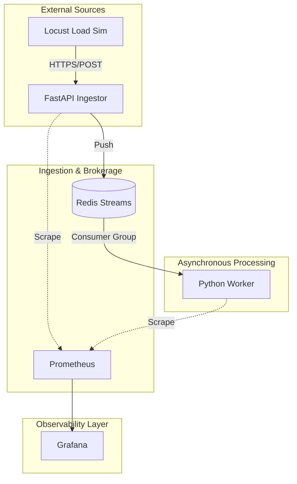

# Architecture & Solution Design: Distributed IoT Ingestion

This document outlines the architectural decisions, technical patterns, and 12-Factor principles implemented in this enterprise-standard blueprint.

## 1. High-Level Architecture
The system employs a **Decoupled Event-Driven Architecture**. By separating the high-frequency ingestion entry point from the heavy transformation logic, we ensure the system can absorb massive telemetric bursts without loss of data.

## 2. 12-Factor Design Patrons

### I. External Configuration (Code/Config Separation)
The system utilizes a centralized `config/settings.yaml` managed by a dedicated `config_loader.py`. This allows for environment-parity; thresholds and broker URLs can be tuned via environmental variables without rebuilding containers.

### II. Stateless Processes
Both the `Ingestor` and `Worker` are stateless. They share no local data and communicate exclusively via the Redis Broker. This allows for **Horizontal Scaling**—adding N workers during peak loads.

### III. Disposability
Services are designed to be "Disposable." If a worker crashes, the Redis Consumer Group ensures that no message is lost; another worker will pick up the unprocessed stream items.

## 3. Technical Implementation Details

| Pillar | Implementation | Rationale |
| :--- | :--- | :--- |
| **Governance** | Pydantic Validators | Ensures Zero-Trust data integrity at the entry point. |
| **Messaging** | Redis Streams | Provides persistence, acknowledgment (ACK), and consumer groups (Mini-Kafka). |
| **Observability** | Prometheus Exporters | Moves beyond "logging" to "instrumentation." |
| **Validation** | Schema Enforcement | Rejects malformed IoT packets before they reach the broker. |

## 4. Decision Log (ADRs)

### ADR 003: Migration to Redis Streams
- **Decision:** Replace In-memory Async Queue with Redis Streams.
- **Context:** Local queues are volatile. Using a persistent broker allows for worker restarts and guarantees at-least-once delivery.

### ADR 004: Centralized YAML Configuration
- **Decision:** Use YAML + Config Loader.
- **Context:** Hardcoded constants are an anti-pattern. Centralizing governance rules (like `vibration_threshold`) allows operations teams to tune the system live.

### ADR 005: Metrics-Driven Scaling
- **Decision:** Instrument every service with Prometheus Counter/Histogram.
- **Context:** In enterprise systems, you cannot manage what you do not measure. These metrics feed into HPA (Horizontal Pod Autoscalers) in K8s.

### ADR 006: Dead Letter Queue (DLQ) for Poison Pill Resilience
- **Decision:** Implement a secondary stream `telemetry_dlq` for failed processing.
- **Context:** Decoupled systems must handle "bad data" without crashing consumers. Shunting malformed or physically impossible readings to a DLQ allows engineers to audit the "Why" without stopping the ingestion pipeline.

---
*Authored by Gaurav Sharma — Solutions Architect*

---
*Authored by Gaurav Sharma — Solutions Architect*
